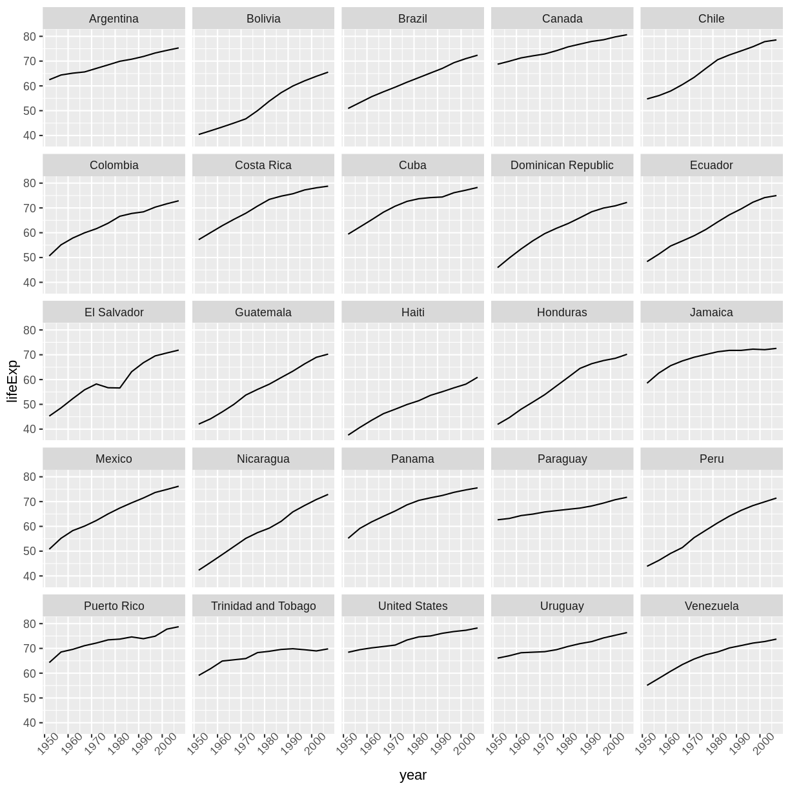
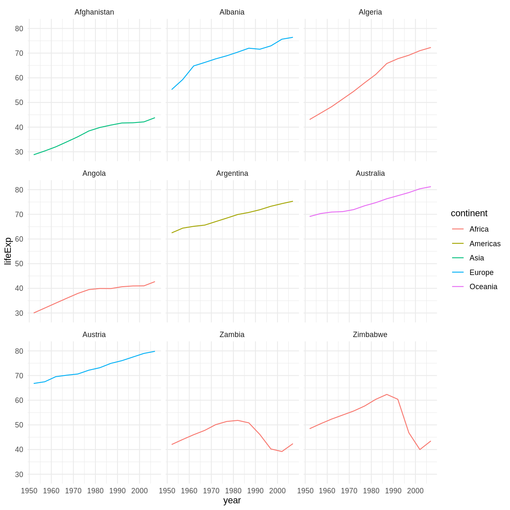

## Combining `dplyr` and `ggplot2`

First install and load ggplot2:

~~~
install.packages('ggplot2')
~~~
{: .language-r}

~~~
library("ggplot2")
~~~
{: .language-r}

In the plotting lesson we looked at how to make a multi-panel figure by adding
a layer of facet panels using `ggplot2`. Here is the code we used (with some
extra comments):

~~~
# Filter countries located in the Americas
americas <- gapminder[gapminder$continent == "Americas", ]
# Make the plot
ggplot(data = americas, mapping = aes(x = year, y = lifeExp)) +
  geom_line() +
  facet_wrap( ~ country) +
  theme(axis.text.x = element_text(angle = 45))
~~~
{: .language-r}

This code makes the right plot but it also creates an intermediate variable
(`americas`) that we might not have any other uses for. Just as we used
`%>%` to pipe data along a chain of `dplyr` functions we can use it to pass data
to `ggplot()`. Because `%>%` replaces the first argument in a function we don't
need to specify the `data =` argument in the `ggplot()` function. By combining
`dplyr` and `ggplot2` functions we can make the same figure without creating any
new variables or modifying the data.

~~~
gapminder %>%
  # Filter countries located in the Americas
  filter(continent == "Americas") %>%
  # Make the plot
  ggplot(mapping = aes(x = year, y = lifeExp)) +
  geom_line() +
  facet_wrap( ~ country) +
  theme(axis.text.x = element_text(angle = 45))
~~~
{: .language-r}

More examples of using the function `mutate()` and the `ggplot2` package.

~~~
gapminder %>%
  # extract first letter of country name into new column
  mutate(startsWith = substr(country, 1, 1)) %>%
  # only keep countries starting with A or Z
  filter(startsWith %in% c("A", "Z")) %>%
  # plot lifeExp into facets
  ggplot(aes(x = year, y = lifeExp, colour = continent)) +
  geom_line() +
  facet_wrap(vars(country)) +
  theme_minimal()
~~~
{: .language-r}

> ## Advanced Challenge
>
> Calculate the average life expectancy in 2002 of 2 randomly selected countries
> for each continent. Then arrange the continent names in reverse order.
> **Hint:** Use the `dplyr` functions `arrange()` and `sample_n()`, they have
> similar syntax to other dplyr functions.
>
> > ## Solution to Advanced Challenge
> >
> >~~~
> >lifeExp_2countries_bycontinents <- gapminder %>%
> >    filter(year==2002) %>%
> >    group_by(continent) %>%
> >    sample_n(2) %>%
> >    summarize(mean_lifeExp=mean(lifeExp)) %>%
> >    arrange(desc(mean_lifeExp))
> >~~~
> >{: .language-r}
> {: .solution}
{: .challenge}

## Other great resources

* [R for Data Science](http://r4ds.had.co.nz/)
* [Data Wrangling Cheat sheet](https://www.rstudio.com/wp-content/uploads/2015/02/data-wrangling-cheatsheet.pdf)
* [Introduction to dplyr](https://dplyr.tidyverse.org/)
* [Data wrangling with R and RStudio](https://www.rstudio.com/resources/webinars/data-wrangling-with-r-and-rstudio/)
